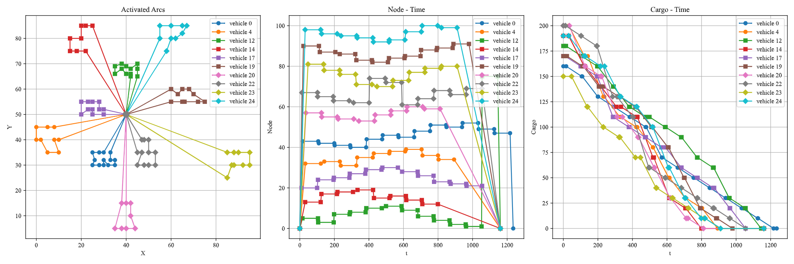
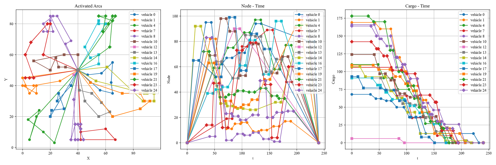

# VRP with Vehicle Capacity and Time Window Constraints

**VRPTW-gurobipy**: Solving the Solomon VRPTW with direct MIP formulation using gurobipy.




## Setting up

```
pip3 install numpy gurobipy matplotlib tabulate
```

Executable scripts are `solve.py` and `plot.py`. Read through `README` before running them.

## `dataset`

This folder stores the Solomon dataset downloaded from http://www.vrp-rep.org/variants/item/vrptw.html, and a simple dataset representing small scenarios. The small scenarios are also solved in Excel.

## `result`

This directory contains solutions in the format of text files. `pretty*` files are human-friendly and `raw*` files store flattened decision matrices. In `visual.plot_solution()`, `fileutil.pretty_print()` is called to generate `pretty*` from `raw*`.

You can find visualization of results in `result/fig`.

`result/comparison.txt` shows the performance of the implemented solver, compared to the SOTA results 2005.

## `core.py`

MIP formulation and solver using gurobipy.

## `fileutil.py`

Functions related to file operation.

## `plot.py`

Running this script generates figures from the `raw*` results, updates `pretty*` results, shows figures of small scenarios, and saves the comparison file.

## `solve.py`

It calls the solver to solve all problems in the dataset. `solve_solomon()` needs a full gurobi liscense to work properly, while `solve_simple_test()` does not.

## `SOTA2005.py`

Stores the results of the state-of-the-art solutions to the Solomon problems.

## `visual.py`

Function for visualizing results.

## Reference

http://alvarestech.com/temp/vrptw/Vehicle%20Routing%20Problem%20with%20Time%20Windows.pdf
